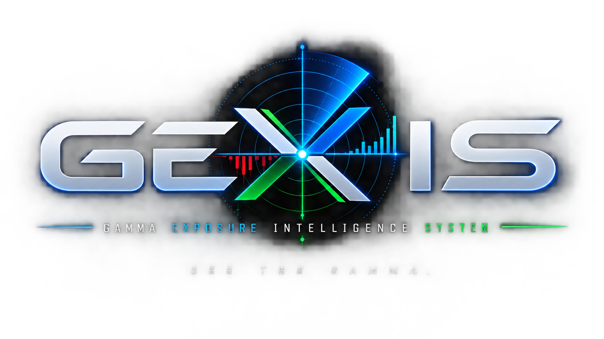

  <strong>Hi 👋, I'm Trimi</strong>

<h3>Junior Full-Stack Developer | React • Node.js • PostgreSQL • Flutter</h3>

I'm a junior full-stack developer interested in building web and mobile applications.

I enjoy working across the frontend, backend, mobile, and database layers of an application.

<ul>
  <li>💻 Interested in Web Development, Mobile Development & Backend Development</li>
  <li>📍 Based in the Philippines</li>
</ul>

---

## 🛠️ Technologies & Tools

### Frontend

### Backend & APIs

### Mobile

### Programming Languages

### Tools & Infrastructure

### Other

REST APIs

---

# 🚍 Featured Project

---

<h3>
  
  &nbsp; Manibela App & Admin Website
</h3>

A transportation management and monitoring system I designed and developed, consisting of a commuter mobile application and an administrative web dashboard.

**Manibela App** — A commuter-focused mobile application for finding nearby jeepneys, monitoring transportation, rating or reporting drivers, and accessing emergency services.

**Manibela Admin Website** — An administrative dashboard for managing commuters, drivers, jeepneys, incidents, ID verification, live monitoring, and transportation data.

Built using:

`Flutter` `Dart` `React` `TypeScript` `Vite` `Tailwind CSS` `Node.js` `Express`
`REST APIs` `PostgreSQL` `Prisma` `Leaflet` `Google Maps`

### Highlights

* 📱 Commuter mobile application
* 🖥️ Administrative web dashboard
* 🔐 Authentication & protected routes
* 👥 Commuter & driver management
* 🪪 ID verification
* 🚌 Jeepney & passenger monitoring
* 🗺️ Maps & location tracking
* ⭐ Driver rating & reporting
* 🚨 Incident reports & emergency hotlines
* 📊 Dashboard & data management
* 📈 Reports & data export

**My Role:** Designed and developed both the Manibela mobile application and Admin Website, including the UI/UX, frontend development, authentication, navigation, maps, API integration, database integration, monitoring features, and administrative functionality.

[View App Repository →](https://github.com/lvrl3e/ManibelApp-App.git)

[View Admin Website Repository →](https://github.com/lvrl3e/ManibelApp-Admin-Website)

---

<h3>
  
  &nbsp; P&Loom
</h3>

A modern trading performance journal designed for traders to track **multiple trading accounts, daily P&L, trading performance, notes, and screenshots**.

Built with:

`Python` `Streamlit` `SQLite` `Pandas` `Plotly`

### Highlights

- 💼 Multiple trading account tracking
- 💰 Daily profit & loss logging
- 📅 Calendar-based trading journal
- 📈 Equity & performance analytics
- 🎯 Prop-firm account progress tracking
- 📝 Daily trading notes
- 📸 Trading screenshot attachments
- 📊 Win/loss and performance statistics
- 🌙 Dark trading-terminal inspired interface

**My Role:** Designed and developed P&Loom, including the dashboard, account tracking system, daily journal, calculations, analytics, and user interface.

[View Repository →](https://github.com/lvrl3e/p-and-loom.git)

---

<h3>
  
  &nbsp; GEXIS — Gamma Exposure Intelligence System
</h3>

A market analytics dashboard I designed and developed for visualizing **Gamma Exposure (GEX)** and options-market structure for NQ traders.

Built using:

`Python` `Streamlit` `yfinance` `Pandas` `NumPy` `Plotly`

### Highlights

- 📊 Gamma Exposure Radar
- 🎯 Gamma Flip / Zero Gamma
- 🟢 Call Wall & 🔴 Put Wall
- ⚡ Maximum GEX detection
- 📈 Positive / Negative Gamma regime
- 📉 GEX distribution by strike
- 🔎 NDX options analysis for NQ trading
- 🔄 Yahoo Finance market-data integration
- 🌙 Professional dark trading-terminal UI
- 📡 Delayed market-data status indicator

**My Role:** Designed and developed GEXIS, including the dashboard architecture, GEX visualization, market-structure calculations, data integration, and trading-focused UI.

**[View Repository →](https://github.com/lvrl3e/gexis.git)**

--- 

<h3>
  <alt="Bloom Logo" width="45" height="45" align="middle"/>
  &nbsp; 🌸 BLOOM — Personal Finance & Goals App
</h3>

A premium personal finance app I designed and developed for tracking bank/e-wallet balances, income & expenses, and savings goals, with a custom black-and-pink fintech design system.

Built with:

`Flutter` `Dart` `SQLite` `Provider` `fl_chart`

### Highlights

- 🏦 Manual multi-account tracking (banks, e-wallets, cash, credit cards) — no credentials ever stored
- 💸 Income, expense & transfer transactions with automatic balance sync across accounts
- 🎯 Financial goals with live progress, required monthly savings, and status tracking (On Track / Behind / At Risk / Completed)
- 📊 Analytics dashboard — income vs. expenses, net worth trend, spending by category
- 💾 Local SQLite database with a clean UI → Services → Database architecture
- 🇵🇭 Full Philippine Peso (₱) formatting throughout
- 🎨 Custom minimalist fintech design system (black, white, bloom pink)

[View Repository →](https://github.com/lvrl3e/bloom.git)

# 🤝 Collaborative Projects

### 🌊 FloodWatch — Flood Monitoring & Drainage Operations

A collaborative flood monitoring platform designed to help local government
units monitor flood conditions, water levels, affected streets, and
operational status.

**My Contribution:** Research & System Planning

I contributed to the project through research and system planning, including
problem research, requirements gathering, feature research, and contributing
ideas for system functionality and data presentation.

**Project Type:** Collaborative Project

[🌐 View Live Project →](https://map-floodwatch.lovable.app/)

---

### 🎮 AS2RO-SHOO2ERS

A collaborative game application developed as part of a Computer Programming
project.

**My Contribution:** Research

I contributed to the project through research and planning that supported the
team's development process, including researching the game concept, gameplay
ideas, relevant references, and project requirements.

**Project Type:** Collaborative Academic Project

[🎮 View Repository →](https://github.com/RomanAragorn/AS2RO-SHOO2ERS)

# 📊 GitHub Stats

---

# 📫 Connect With Me

